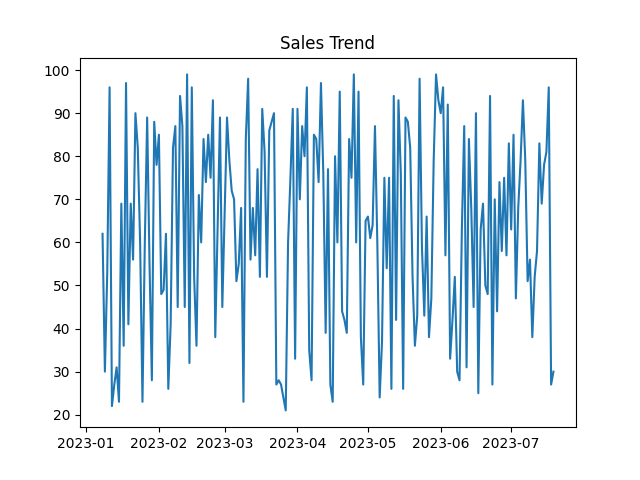
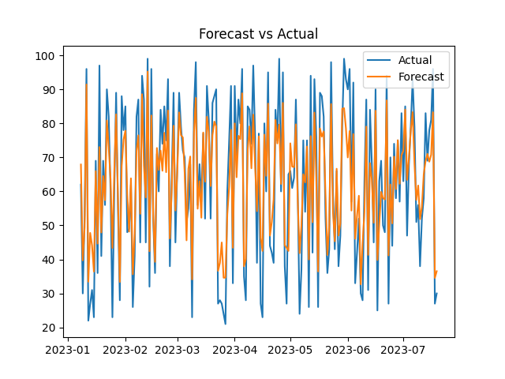
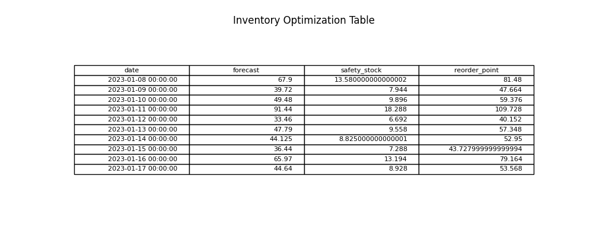

# 🚀 Retail Sales Forecasting & Inventory Optimization System

---

## 📌 Project Overview

This project is an **end-to-end Retail Analytics System** that predicts future product demand and optimizes inventory decisions using Machine Learning.

It combines:

* 📊 Sales Forecasting
* 📦 Inventory Optimization
* 📈 Business Insights

to simulate how real retail companies manage stock efficiently.

---

## ❗ Problem Statement

Retail businesses often face:

* Stockouts (lost sales)
* Overstocking (high holding costs)
* Inefficient demand planning

This system addresses these issues by forecasting demand and optimizing inventory decisions.

---

## 🏭 Industry Relevance

This system is widely used in:

* E-commerce platforms
* Supermarkets
* Retail chains

It helps improve:

* Demand planning
* Supply chain efficiency
* Inventory control
* Profitability

---

## 💼 Business Value

* Reduces stockouts
* Optimizes inventory levels
* Improves operational efficiency
* Enhances decision-making

---

## ⚙️ Tech Stack

* Python
* Pandas
* NumPy
* Scikit-learn
* Matplotlib
* Seaborn

---

## 🏗️ Project Architecture

```
Data → Preprocessing → Feature Engineering → Model → Forecast → Inventory Optimization → Outputs
```

---

## 📁 Folder Structure

```
Retail-Sales-Forecasting/
│
├── data/
├── src/
├── models/
├── outputs/
├── images/
├── main.py
├── requirements.txt
├── README.md
└── .gitignore
```

---

## ⚡ Installation

```bash
python -m venv venv
venv\Scripts\activate
pip install -r requirements.txt
```

---

## ▶️ How to Run

```bash
python main.py
```

---

## 🔄 Simulation Workflow

1. Generate synthetic dataset
2. Perform preprocessing
3. Apply feature engineering
4. Train forecasting model
5. Generate predictions
6. Apply inventory optimization logic
7. Visualize outputs

---

## 📊 Project Outputs

### Sales Trend



### Forecast vs Actual



### Inventory Optimization



---

## 📌 Key Features

* Sales forecasting using Machine Learning
* Inventory optimization logic
* Safety stock calculation
* Reorder point generation
* Data visualization

---

## 📈 Sample Output

| Date | Forecast | Safety Stock | Reorder Point |
| ---- | -------- | ------------ | ------------- |
| ...  | 80       | 16           | 96            |

---

## 🧠 Learning Outcomes

* Time series forecasting
* Feature engineering
* Business analytics thinking
* Inventory management concepts
* End-to-end ML pipeline development

---

## 🚀 Future Improvements

* Multi-store forecasting
* Advanced ML models (XGBoost, ARIMA)
* Streamlit dashboard
* Real-time analytics
* External factor integration

---

## 📸 Screenshots

All outputs are available in the `/images` folder.

---

## ✍️ Author

**Ananya Jain**
